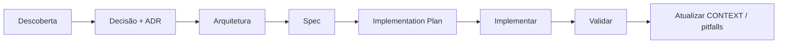

# Tutorial prático: fluxo CDD do início ao fim

> Material de apoio do repositório CDD — não é instalado via `cdd init`.
> Leia aqui no GitHub ou no clone deste repositório.

Este tutorial percorre o fluxo completo do Context-Driven Development usando um projeto imaginário — **TaskFlow**, um app de tarefas simples. O foco é o **processo**, não a stack: você pode adaptar os mesmos passos para qualquer projeto.

---

## O cenário

Você está construindo o **TaskFlow**: um app web onde usuários criam listas de tarefas, marcam itens como concluídos e filtram por status. A primeira feature a entregar é **"CRUD de tarefas"**.

Stack escolhida (apenas para o exemplo):

- Next.js 15 (App Router)
- SQLite via Drizzle ORM
- Vitest para testes

O código ainda não existe. O que existe é o repositório com CDD instalado (`npx cdd init`).

---

## Visão geral do fluxo



| Etapa | Quem faz | Artefato |
|-------|----------|----------|
| Descoberta | Você | Notas em `docs/discovery/` |
| Decisão arquitetural | Você | Conversa + ADR |
| Formalizar arquitetura | Agente | `docs/architecture/` |
| Escrever spec | Agente | `docs/specs/` |
| Aprovar spec | Você | Status `aprovado` na spec |
| Quebrar em tarefas | Agente | `docs/implementation-plan/` |
| Implementar | Agente | Código + testes |
| Validar | Você | Critérios de aceite da spec |
| Manter contexto | Você aprova, agente sugere | `CONTEXT.md`, `pitfalls.md` |

---

## Etapa 0: Instalar e preparar o projeto

```bash
npm install -D context-driven-dev
npx cdd init --platform cursor
```

Após a instalação, a estrutura relevante fica assim:

```
taskflow/
  docs/
    CONTEXT.md              ← preencher primeiro
    pitfalls.md
    discovery/
    architecture/
    specs/
    adr/
    implementation-plan/
    guidelines/
  .cursor/
    rules/
    skills/
```

**Regra de ouro:** antes de pedir código, preencha o `CONTEXT.md`. Sem isso, o agente inventa convenções a cada sessão.

---

## Etapa 1: Preencher o CONTEXT.md

O `CONTEXT.md` é o ponto de entrada de toda sessão. Mantenha curto — só o que o agente erraria sem orientação.

Exemplo para o TaskFlow:

```markdown
# Contexto do Projeto

## O que é
TaskFlow — app web de listas de tarefas pessoais.

## Stack
- **Runtime:** Node.js 22
- **Framework:** Next.js 15 (App Router)
- **Banco de dados:** SQLite (arquivo local em dev)
- **ORM:** Drizzle
- **Testes:** Vitest + Testing Library

## Decisões arquiteturais principais
- Server Actions para mutações — ver ADR-001
- Camadas: route → action → service → repository — ver docs/architecture/tasks.md

## Convenções de código
- Lógica de negócio só em `src/services/`, nunca em components ou actions
- Actions validam input com Zod e delegam ao service
- Um arquivo de teste por service: `task.service.test.ts` ao lado do service

## Módulos principais
| Módulo | Responsabilidade | Docs relacionados |
|--------|------------------|-------------------|
| tasks | CRUD de tarefas | /docs/architecture/tasks.md |

## ADRs ativos
- [001 - Server Actions para mutações](/docs/adr/001-server-actions.md)

## Quando atualizar este arquivo
Atualize se algum destes itens mudar:
- Decisão arquitetural tomada ou alterada
- Nova dependência relevante adicionada
- Convenção de código estabelecida
- Escopo de um módulo alterado
- Novo ADR criado
```

**Prompt no Cursor (opcional):**

```
Leia @docs/CONTEXT.md. Estou iniciando o projeto TaskFlow.
Revise se está completo para começarmos a feature de CRUD de tarefas.
Não escreva código ainda.
```

---

## Etapa 2: Descoberta

A descoberta acontece **fora do fluxo de implementação** — pode ser num chat separado, numa conversa com o time, ou numa sessão exploratória no Cursor. O objetivo é entender o problema, não gerar código.

Para o TaskFlow, você anotou em `docs/discovery/task-crud.md`:

```markdown
# Descoberta: CRUD de tarefas

## Problema
Usuário precisa criar, listar, editar e excluir tarefas numa única lista.

## Requisitos levantados
- Título obrigatório (1–200 chars)
- Status: pending | done
- Ordenação: mais recentes primeiro
- Sem autenticação nesta versão (single-user local)

## Tradeoffs discutidos
- REST API vs Server Actions → Actions simplificam para MVP single-user
- PostgreSQL vs SQLite → SQLite basta para dev e demo

## Decisões tomadas (ainda não formalizadas)
- Usar Server Actions
- SQLite + Drizzle
```

**Importante:** arquivos em `docs/discovery/` são mantidos manualmente. O agente pode ajudar a organizar notas, mas a validação é sua.

---

## Etapa 3: Registrar a decisão (ADR)

Decisões arquiteturais vão para `docs/adr/`. Se não estão escritas, não existem para o agente na próxima sessão.

**Prompt no Cursor:**

```
Leia @docs/CONTEXT.md e @docs/discovery/task-crud.md.
Use a skill adr-writer para registrar a decisão de usar Server Actions
para mutações no TaskFlow. Alternativas consideradas: Route Handlers REST
e tRPC.
```

O agente gera `docs/adr/001-server-actions.md`:

```markdown
# ADR-001: Server Actions para mutações

**Data:** 2026-06-27
**Status:** aceito

## Contexto
O TaskFlow é um MVP single-user sem necessidade de API pública.
Precisamos de um canal para criar, atualizar e excluir tarefas a partir
dos componentes React.

## Alternativas consideradas
- **Route Handlers REST** — descartada: boilerplate extra (rotas, fetch,
  tratamento de erro HTTP) sem benefício para UI acoplada ao Next.js
- **tRPC** — descartada: dependência e setup desproporcionais ao escopo

## Decisão
Usar Server Actions do Next.js para todas as mutações de tarefas.

## Tradeoffs
- Acoplamento ao Next.js — aceitável para este produto
- Testes de actions exigem mocks de `revalidatePath` — documentado na spec

## Consequências
- Actions em `src/actions/task.actions.ts`
- Validação com Zod na borda da action
- Services permanecem testáveis de forma isolada
```

Depois, atualize o `CONTEXT.md` com o link para o ADR (como no exemplo da Etapa 1).

---

## Etapa 4: Formalizar a arquitetura

Com a decisão registrada, documente **como** o módulo funciona — componentes, fluxos, dependências.

**Prompt no Cursor:**

```
Leia @docs/CONTEXT.md, @docs/adr/001-server-actions.md e
@docs/discovery/task-crud.md.
Use a skill architecture-writer para documentar o módulo de tarefas
em docs/architecture/tasks.md.
```

Trecho do resultado (`docs/architecture/tasks.md`):

```markdown
# Arquitetura: Módulo de Tarefas

**Status:** definido
**ADRs relacionados:** [ADR-001](/docs/adr/001-server-actions.md)

## Visão geral
O módulo de tarefas gerencia o ciclo de vida de itens numa lista única.
Mutations passam por Server Actions; leitura usa Server Components com
query direta no service.

## Responsabilidades
- Persistir tarefas (título, status, timestamps)
- Listar tarefas ordenadas por `createdAt` desc
- Alternar status pending ↔ done

**Fora do escopo:** autenticação, múltiplas listas, tags

## Componentes

| Camada | Arquivo | Papel |
|--------|---------|-------|
| UI | `src/components/task-list.tsx` | Renderiza lista, dispara actions |
| Action | `src/actions/task.actions.ts` | Valida input, chama service |
| Service | `src/services/task.service.ts` | Regras de negócio |
| Repository | `src/repositories/task.repository.ts` | Acesso ao Drizzle/SQLite |
| Schema | `src/db/schema.ts` | Tabela `tasks` |

## Fluxo: criar tarefa

1. Usuário submete formulário em `TaskList`
2. `createTask` action valida `{ title }` com Zod
3. `taskService.create(title)` persiste via repository
4. `revalidatePath('/')` atualiza a lista
```

---

## Etapa 5: Escrever a spec

A spec é a **fonte de verdade do comportamento**. O agente implementa o que está na spec — nem mais, nem menos.

**Prompt no Cursor:**

```
Leia @docs/CONTEXT.md, @docs/architecture/tasks.md e @docs/adr/001-server-actions.md.
Use a skill spec-writer para criar a spec de CRUD de tarefas.
Fora do escopo: autenticação, edição de título, múltiplas listas.
```

Exemplo de `docs/specs/task-crud.md`:

```markdown
# Spec: CRUD de Tarefas

**Status:** rascunho
**Arquitetura relacionada:** [/docs/architecture/tasks.md](/docs/architecture/tasks.md)
**ADRs relacionados:** [ADR-001](/docs/adr/001-server-actions.md)

## Objetivo
Permitir que o usuário gerencie tarefas numa lista única: criar, listar,
marcar como concluída e excluir.

## Comportamento esperado

### Listar tarefas
- Ao carregar a página inicial, o sistema exibe todas as tarefas
- Ordenação: `createdAt` decrescente (mais recente primeiro)
- Cada item mostra: título, status (pending/done), botões de ação

### Criar tarefa
- Formulário com campo "título" e botão "Adicionar"
- Ao submeter título válido, a tarefa aparece no topo da lista sem reload completo
- Título vazio ou só espaços: exibir erro inline, não criar tarefa

### Alternar status
- Tarefa pending → clicar em "Concluir" → status vira done
- Tarefa done → clicar em "Reabrir" → status vira pending

### Excluir tarefa
- Clicar em "Excluir" remove a tarefa da lista imediatamente
- Não há confirmação nesta versão

## Casos de borda
- Título com mais de 200 caracteres: rejeitar com mensagem de erro
- Lista vazia: exibir estado vazio "Nenhuma tarefa ainda"
- Falha de banco: exibir mensagem genérica, não quebrar a página

## Fora do escopo
- Autenticação e multi-usuário
- Editar título de tarefa existente
- Múltiplas listas ou projetos
- Confirmação antes de excluir

## Critérios de aceite
- [ ] Usuário cria tarefa com título válido e vê na lista
- [ ] Título vazio não cria tarefa e mostra erro
- [ ] Usuário alterna status pending ↔ done
- [ ] Usuário exclui tarefa e ela some da lista
- [ ] Lista vazia mostra mensagem de estado vazio
- [ ] Tarefas ordenadas da mais recente para a mais antiga

## Estratégia de teste
- **Unitário:** `task.service` — create, list, toggle, delete; validação de título
- **Integração:** action `createTask` com service mockado; repository com SQLite em memória
- **E2E:** não necessário nesta iteração

## Notas de implementação
- Seguir camadas definidas em docs/architecture/tasks.md
- Validação de título no service (regra de negócio) e na action (borda)
```

### Sua parte: revisar e aprovar

Leia a spec com olhar crítico:

- O comportamento está completo?
- Os critérios de aceite são testáveis?
- O "fora do escopo" protege contra scope creep?

Se estiver ok, mude o status:

```markdown
**Status:** aprovado
```

**Não peça implementação com spec em `rascunho`.** As rules do projeto instruem o agente a seguir apenas specs aprovadas.

---

## Etapa 6: Quebrar em tarefas (implementation plan)

**Prompt no Cursor:**

```
A spec @docs/specs/task-crud.md está aprovada.
Use a skill task-breakdown para gerar o implementation plan.
```

Exemplo de `docs/implementation-plan/task-crud.md`:

```markdown
# Implementation Plan: CRUD de Tarefas

**Spec:** [/docs/specs/task-crud.md](/docs/specs/task-crud.md)
**Status:** pendente

## Contexto
Implementação bottom-up: schema → repository → service → actions → UI → testes.
Cada tarefa cabe em uma sessão do Cursor.

## Tarefas

### Fase 1: Fundação
- [ ] **[1.1]** Criar schema Drizzle da tabela `tasks`
  - _O que fazer:_ campos id, title, status (enum), createdAt, updatedAt
  - _Critério de conclusão:_ migration aplicada, tabela existe no SQLite

- [ ] **[1.2]** Implementar `task.repository.ts`
  - _O que fazer:_ create, findAll, updateStatus, delete
  - _Critério de conclusão:_ métodos funcionam contra SQLite de dev

### Fase 2: Lógica principal
- [ ] **[2.1]** Implementar `task.service.ts`
  - _O que fazer:_ regras de validação de título, delegação ao repository
  - _Critério de conclusão:_ `task.service.test.ts` passando

- [ ] **[2.2]** Implementar `task.actions.ts`
  - _O que fazer:_ createTask, toggleTask, deleteTask com Zod + revalidatePath
  - _Critério de conclusão:_ actions chamam service e tratam erros de validação

### Fase 3: UI
- [ ] **[3.1]** Componentes `TaskList`, `TaskItem`, `TaskForm`
  - _O que fazer:_ listagem, formulário, botões de ação wired às actions
  - _Critério de conclusão:_ página `/` funcional manualmente

### Fase 4: Testes e revisão
- [ ] **[4.1]** Testes de integração do repository (SQLite em memória)
- [ ] **[4.2]** Verificar todos os critérios de aceite da spec
- [ ] **[4.3]** Atualizar CONTEXT.md se necessário
```

Revise a granularidade. Prefere tarefas menores? Peça ao agente para subdividir. Prefere menos checkpoints? Combine fases.

---

## Etapa 7: Implementar — uma tarefa por sessão

Cada sessão do Cursor deve ser **focada**. O padrão de abertura:

```
Read @docs/CONTEXT.md before starting.
We're working on @docs/specs/task-crud.md,
task 2.1 in @docs/implementation-plan/task-crud.md
```

### Exemplo: tarefa 2.1

O agente vai:

1. Ler `CONTEXT.md`, a spec e o plano
2. Consultar `pitfalls.md` e guidelines relevantes (ex.: `docs/guidelines/testing.md`)
3. Implementar **apenas** a tarefa 2.1
4. Escrever os testes definidos na spec
5. Marcar a tarefa como concluída no plano

Após revisar o código, você marca no plano:

```markdown
- [x] **[2.1]** Implementar `task.service.ts`
```

### O que o agente não deve fazer

- Implementar tarefa 3.1 quando você pediu 2.1
- Adicionar "editar título" porque "ficaria melhor"
- Pular testes se a spec exige cobertura

As rules em `.cursor/rules/` reforçam isso automaticamente.

### Quando algo dá errado

Se o agente comete um erro que pode se repetir, registre em `docs/pitfalls.md`:

```markdown
#### Validação duplicada só na action

**Contexto:** ao criar tarefas
**Erro:** validação de título apenas na action, service aceita string vazia
**Correto:** validar no service (regra de negócio) e na action (borda)
**Referência:** docs/specs/task-crud.md
```

Na próxima sessão, o agente lê `pitfalls.md` antes de implementar.

---

## Etapa 8: Validar

A implementação só está pronta quando **você** valida contra os critérios de aceite da spec — não quando o agente diz que terminou.

Checklist para o TaskFlow:

| Critério | Como validar |
|----------|--------------|
| Criar tarefa válida | Adicionar "Comprar leite" → aparece no topo |
| Título vazio | Submeter vazio → erro inline, lista inalterada |
| Alternar status | Concluir e reabrir → status muda |
| Excluir | Excluir item → some da lista |
| Lista vazia | Banco vazio → mensagem de estado vazio |
| Ordenação | Criar A, depois B → B aparece antes de A |

Rode os testes:

```bash
npm test
```

Se algo falhar, abra nova sessão apontando para a tarefa relevante — não tente consertar tudo num prompt gigante.

---

## Etapa 9: Encerrar a feature

1. Marque a spec como implementada: `**Status:** implementado`
2. Marque o plano como concluído
3. Revise se `CONTEXT.md` precisa de atualização (novas convenções, módulos)
4. Confirme que `pitfalls.md` tem entradas úteis geradas durante o trabalho

**Prompt:**

```
Revise a implementação de @docs/specs/task-crud.md contra os critérios
de aceite. Sugira atualizações em @docs/CONTEXT.md se necessário.
Não escreva código.
```

Você aprova ou edita as sugestões. O agente não deve atualizar `CONTEXT.md` sem sua revisão.

---

## Próxima feature: repetir o ciclo

A segunda feature do TaskFlow poderia ser **"Filtrar tarefas por status"**.

Fluxo resumido:

1. Notas rápidas em `docs/discovery/` (se necessário)
2. ADR só se houver decisão nova (ex.: URL search params vs state local)
3. Atualizar `docs/architecture/tasks.md` ou criar seção na spec
4. Nova spec → aprovar → novo implementation plan → implementar

Features pequenas podem pular arquitetura formal se o módulo já está documentado — use julgamento. O CONTEXT.md e a arquitetura existente já orientam o agente.

---

## Referência rápida de prompts

| Situação | Prompt |
|----------|--------|
| Iniciar sessão de implementação | `Read @docs/CONTEXT.md before starting. We're working on @docs/specs/[spec].md, task [X] in @docs/implementation-plan/[plan].md` |
| Criar spec | `Use a skill spec-writer para [feature]. Leia @docs/CONTEXT.md e arquitetura relacionada.` |
| Criar plano | `Spec aprovada em @docs/specs/[spec].md. Use task-breakdown.` |
| Registrar decisão | `Use adr-writer para documentar [decisão].` |
| Documentar módulo | `Use architecture-writer para [módulo].` |
| Corrigir erro recorrente | Adicione entrada em `@docs/pitfalls.md` manualmente ou peça ajuda para formatar |

---

## O que evitar

| Anti-pattern | Por quê |
|--------------|---------|
| "Implementa o CRUD de tarefas" sem spec | O agente inventa comportamento e padrões |
| Spec eternamente em rascunho | Sem aprovação, não há contrato claro |
| Várias tarefas num único prompt | Difícil revisar; erros se acumulam |
| CONTEXT.md com 500 linhas | Fica desatualizado; agente ignora |
| Pular validação manual | Testes não cobrem tudo que a spec define |
| Documentar discovery/architecture automaticamente | São mantidos manualmente — você decide o que entra |

---

## Resumo

1. **CONTEXT.md** — memória persistente do projeto
2. **Descoberta** — você explora; notas opcionais em `discovery/`
3. **ADR** — decisões que o agente não pode inventar
4. **Arquitetura** — como o módulo se organiza
5. **Spec aprovada** — o que construir
6. **Implementation plan** — em que ordem, tarefa por tarefa
7. **Implementação** — uma tarefa por sessão, com testes
8. **Validação** — você confere critérios de aceite
9. **pitfalls + CONTEXT** — o projeto fica mais inteligente a cada erro corrigido

O TaskFlow é fictício, mas o fluxo é o mesmo para qualquer feature real: **decisões no repositório, execução pelo agente, validação por você.**
